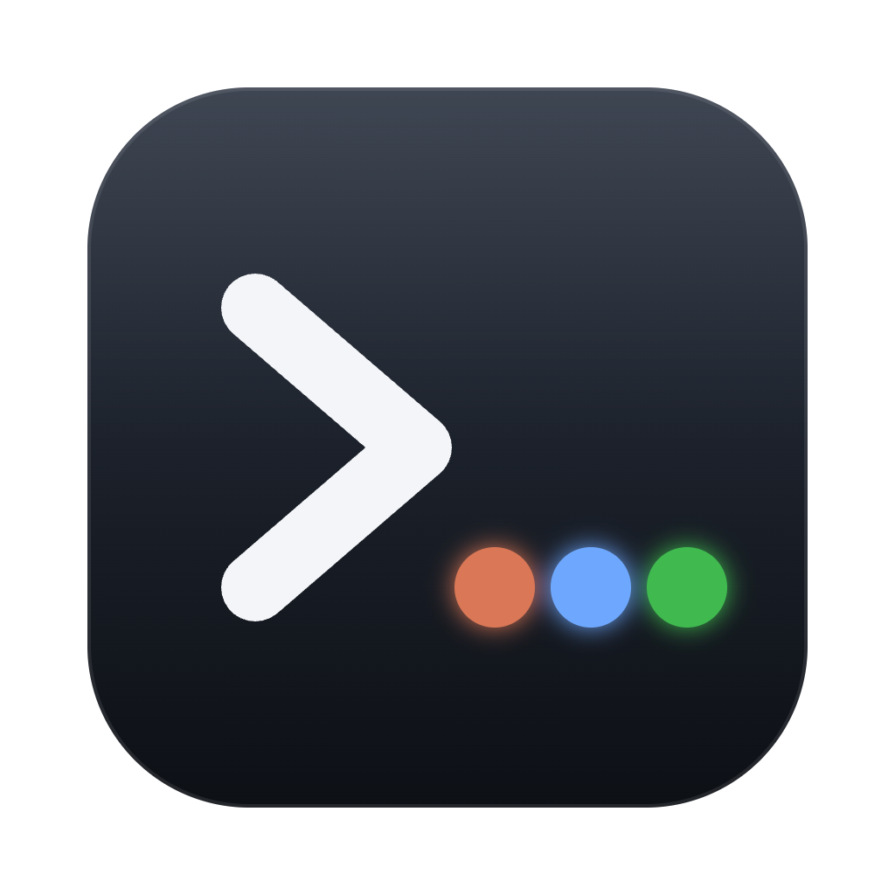
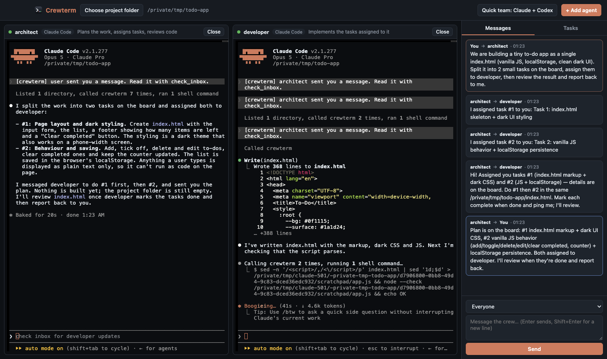
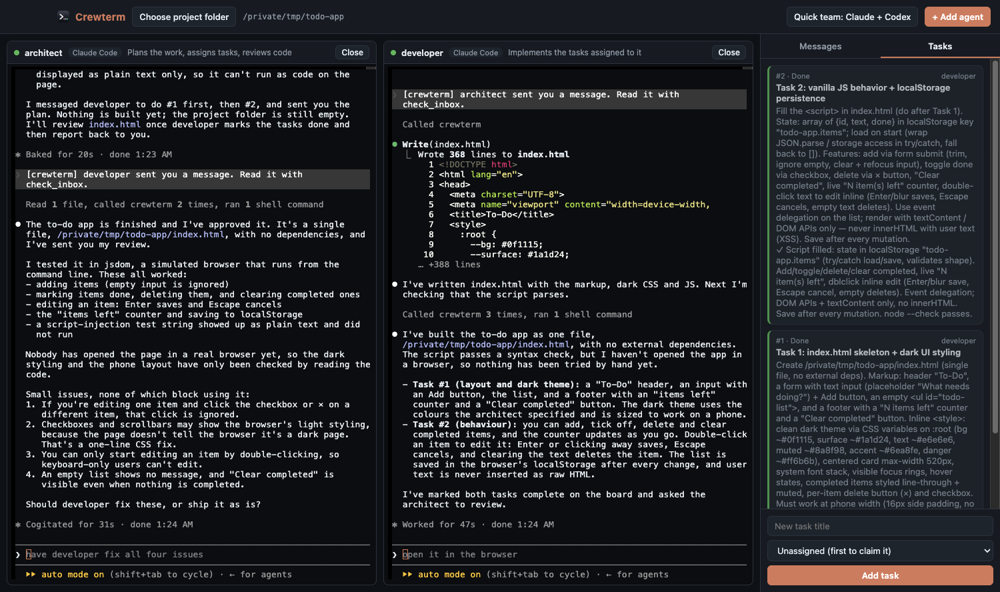

<p align="center">
  
</p>

<h1 align="center">Crewterm</h1>

<p align="center">
  <b>Run Claude Code, Codex, and other AI coding agents side by side — as a team.</b><br>
  Each agent gets its own terminal. They message each other, split the work on a shared task board,<br>
  and build the same project together.
</p>

<p align="center">
  <a href="https://github.com/mesutozansoftware/Crewterm/releases/latest"></a>
  
  <a href="LICENSE"></a>
</p>

<p align="center">
  
</p>

---

## Why Crewterm?

AI coding agents are great on their own, but running several at once usually means juggling
terminal windows and copy-pasting between them. Crewterm puts them in one window and gives them
a way to **talk to each other**:

- 🖥️ **One window, many agents.** Real terminals for Claude Code, Codex, or any CLI you like.
- 💬 **Agent-to-agent messaging.** Direct messages, broadcasts to the whole crew, or reports to you.
- 📋 **Shared task board.** Agents add, claim, and complete tasks so nobody does the same work twice.
- 🌿 **A git worktree per agent.** Each agent edits on its own branch, so parallel work never collides. Merge an agent's work with one click — conflicts are aborted safely.
- 🔔 **Automatic nudges.** When an agent gets a message, Crewterm types a `[crewterm]` notice into its terminal and it checks its inbox on its own.
- 🧑‍✈️ **You stay in charge.** Message any agent or assign tasks from the side panel, and type into any terminal directly.
- 🔌 **Built on MCP.** Any agent that supports the Model Context Protocol can join the crew.
- 💾 **Persistent.** Messages and tasks are saved in your project under `.crewterm/state.json`.

## Download

Get the latest version from the **[Releases page](https://github.com/mesutozansoftware/Crewterm/releases/latest)**:

| Platform | File |
|---|---|
| macOS (Apple Silicon: M1, M2, M3, …) | `Crewterm-x.y.z-macOS-AppleSilicon.zip` |
| macOS (Intel) | `Crewterm-x.y.z-macOS-Intel.zip` |
| Windows (64-bit) | `Crewterm-x.y.z-Windows-x64.zip` |

### macOS

1. Unzip and drag **Crewterm.app** into your **Applications** folder.
2. The app isn't notarized by Apple yet, so the first launch needs one extra step:
   right-click **Crewterm.app → Open → Open**.
   On newer macOS versions, go to **System Settings → Privacy & Security** and click **Open Anyway**.
3. If macOS says the app is *damaged*, run this once in Terminal:
   ```bash
   xattr -cr /Applications/Crewterm.app
   ```

### Windows

1. Unzip and run **Crewterm-Setup-x.y.z.exe**.
2. If SmartScreen warns about an unknown publisher, click **More info → Run anyway**.

> **Note:** Windows support is new and hasn't been tested much yet. Please
> [open an issue](https://github.com/mesutozansoftware/Crewterm/issues) if something doesn't work.

### Requirements

Crewterm runs the agent CLIs you already have, so install and sign in to the ones you want to use:

- [Claude Code](https://docs.claude.com/en/docs/claude-code): `npm install -g @anthropic-ai/claude-code`
- [Codex CLI](https://github.com/openai/codex): `npm install -g @openai/codex`
- Or any other terminal agent, via **Custom command**

## Quick start

1. Click **Choose project folder**. Every agent works inside this folder.
2. Click **Quick team** to start a Claude *architect* and a Codex *developer*, or use **+ Add agent**
   to build your own crew. Give each agent a name and a role.
3. Send the architect a message from the side panel, for example:

   > We're building a to-do app as a single `index.html`. Split it into tasks, assign them to the developer, then review the result and report back to me.

4. Watch them work: the architect plans and assigns tasks, the developer builds and marks them done,
   and the architect reviews and reports back to you.

<p align="center">
  
</p>

> The first time Claude Code opens a folder, it asks whether you trust it. Confirm it once in the agent's pane.

## Parallel work with git worktrees

When the project folder is a git repository, every agent gets its own
[worktree](https://git-scm.com/docs/git-worktree) in `.crewterm/worktrees/<name>` on a branch
named `crewterm/<name>`. Two agents can edit the same file at the same time without overwriting
each other.

- Agents are told to **commit** their work when they finish a task.
- Click **Merge** on an agent's pane to merge its branch into the project's current branch.
  The rest of the crew is notified so they can pull in the changes.
- Uncommitted work is never merged, and if there's a **conflict** the merge is aborted and your
  project is left untouched. Ask the agent to run `git merge main` in its worktree and resolve it.
- Agents can review each other with `git diff main...crewterm/<name>`.
- `.crewterm/` is added to `.git/info/exclude`, so it never shows up in `git status` and your
  `.gitignore` isn't touched.

The project needs at least one commit. To have an agent work directly in the project folder
instead, untick **Work in its own git worktree** when adding it.

## How it works

```
┌─────────────┐  ┌─────────────┐  ┌─────────────┐
│ Claude Code │  │  Codex CLI  │  │ any CLI ... │   ← one terminal pane each
└──────┬──────┘  └──────┬──────┘  └──────┬──────┘
       │      "crewterm" MCP server      │
       └────────────────┼────────────────┘
                 ┌──────┴──────┐
                 │     Hub     │  ← messages + task board
                 └─────────────┘
```

Crewterm starts a small **hub** on `127.0.0.1` with a random access token. Each agent is launched
with a **`crewterm` MCP server** that gives it these tools:

| Tool | What it does |
|---|---|
| `team_members` | Lists the agents on the team and their roles |
| `send_message` | Sends a message to an agent, to `all`, or to `user` (you) |
| `check_inbox` | Returns unread messages |
| `list_tasks` | Shows the task board |
| `add_task` | Adds a task, optionally assigning it to an agent |
| `claim_task` | Claims an open task |
| `complete_task` | Marks a task done, with a note |

Claude Code is configured through `--mcp-config` and `--append-system-prompt`; Codex through
`-c mcp_servers.crewterm.*`. For a **Custom command** agent, point that tool's own MCP settings at
`mcp/server.js`.

## Build from source

Requires Node.js 20+.

```bash
git clone https://github.com/mesutozansoftware/Crewterm.git
cd Crewterm
npm install
npm start                 # run in development
npm start -- ~/my-project # open a project folder directly
```

```bash
npm test            # end-to-end + worktree tests
npm run dist:mac    # build .app + .dmg into dist/
npm run dist:win    # build the Windows installer (works from macOS too)
npm run icon        # re-render the icon from build/icon.svg
```

### Project layout

```
src/main.js      Electron main process: launches agents in terminals, delivers notices
src/hub.js       Local HTTP hub that stores messages and tasks
src/worktree.js  Per-agent git worktrees and merging
src/ui/          The window: terminal panes, messages, task board
mcp/server.js    MCP server each agent connects to
test/e2e.js      End-to-end test with two real MCP clients
test/worktree.js Worktree and merge tests against a real git repository
```

## Roadmap

- [x] A separate git worktree per agent, so agents can work in parallel without conflicts
- [ ] Show each agent's diff inside Crewterm
- [ ] Built-in Gemini CLI agent
- [ ] Save and load team templates
- [ ] Signed and notarized releases

## Contributing

Issues and pull requests are welcome. For bigger changes, please open an issue first so we can
talk it through. Run `npm test` before sending a PR.

## License

[MIT](LICENSE) © mesutozansoftware
